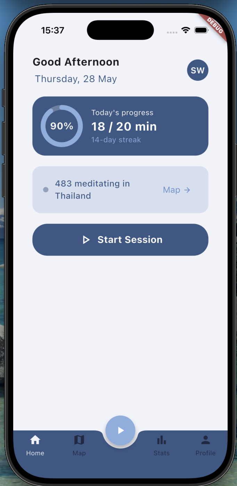
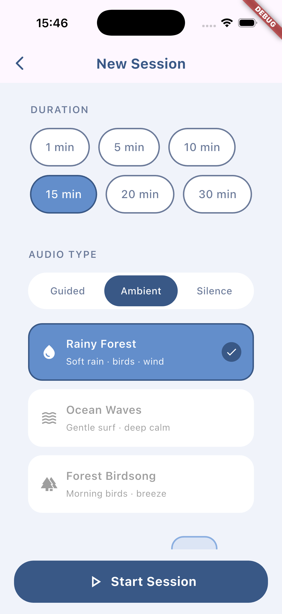
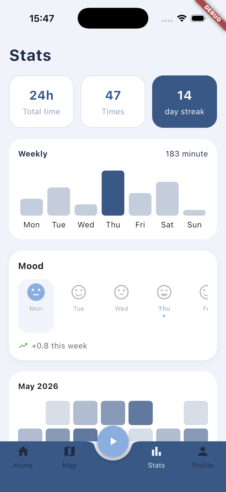

# 🧠 JotJai App

A mindfulness & journaling Flutter application designed to help users reflect their mood, relax with guided sessions, and track their mental wellness over time.

---

## 📱 Features

* 🎧 Guided meditation / focus sessions with audio
* 😊 Mood selection after each session
* ⏱ Session timer with pause & resume
* 🧘 Reflection screen for journaling
* 📊 Weekly mood tracking overview

---

## 📸 Screenshots

> *(Add your app screenshots here)*

| Home                         | Session                         | Result                         |
| ---------------------------- | ------------------------------- | ------------------------------ |
|  |  |  |

---

## 🚀 Getting Started

### Prerequisites

* Flutter SDK (3.x or later)
* Dart SDK

### Installation

```bash
git clone https://github.com/your-username/jot_jai_app.git
cd jot_jai_app
flutter pub get
flutter run
```

---

## 🧱 Tech Stack

* **Framework:** Flutter
* **Language:** Dart
* **Architecture:** Feature-based structure
* **State Management:** (Provider / Riverpod / Bloc)

---

## 📂 Project Structure

```bash
lib/
 ├── core/        # shared utils, theme, constants
 ├── features/    # feature modules (session, mood, etc.)
 └── main.dart
```

---

## 🎯 Future Improvements

* 🔔 Daily reminder notifications
* ☁️ Cloud sync (Firebase / Supabase)
* 📈 Mood analytics dashboard
* 🔐 User authentication

---

## 👨‍💻 Author

**Suriya Wongaiyara**
Flutter Developer

---

## 📄 License

This project is licensed under the MIT License.
# 🧠 JotJai App

A mindfulness & journaling Flutter application designed to help users reflect their mood, relax with guided sessions, and track their mental wellness over time.

---

## 📱 Features

* 🎧 Guided meditation / focus sessions with audio
* 😊 Mood selection after each session
* ⏱ Session timer with pause & resume
* 🧘 Reflection screen for journaling
* 📊 Weekly mood tracking overview

---

## 📸 Screenshots

> *(Add your app screenshots here)*

| Home                         | Session                         | Result                         |
| ---------------------------- | ------------------------------- | ------------------------------ |
|  |  |  |

---

## 🚀 Getting Started

### Prerequisites

* Flutter SDK (3.x or later)
* Dart SDK

### Installation

```bash
git clone https://github.com/wung-satalo/jot_jai_app.git
cd jot_jai_app
flutter pub get
flutter run
```

---

## 🧱 Tech Stack

* **Framework:** Flutter
* **Language:** Dart
* **Architecture:** Feature-based structure
* **State Management:** (Provider / Riverpod / Bloc)

---

## 📂 Project Structure

```bash
lib/
 ├── core/        # shared utils, theme, constants
 ├── features/    # feature modules (session, mood, etc.)
 └── main.dart
```

---

## 🎯 Future Improvements

* 🔔 Daily reminder notifications
* ☁️ Cloud sync (Firebase / Supabase)
* 📈 Mood analytics dashboard
* 🔐 User authentication

---

## 👨‍💻 Author

**Suriya Wongaiyara**
Flutter Developer

---

## 📄 License

This project is licensed under the MIT License.
